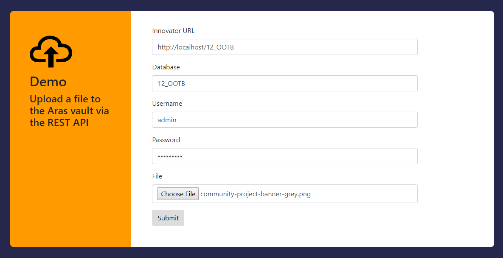

# Uploading Files via the Aras RESTful API

This project provides a simple HTML form and a JavaScript file to demonstrate how to upload files to the Aras vault server via the Aras RESTful API. 

## How It Works

Uploading a file to the Aras vault server via the RESTful API requires three basic steps:

1. Get a transaction id from the vault server
2. Upload the file to the vault
3. Commit the vault transaction to finish the upload

To see these steps in action, check out `submitForm()` in the [my-upload.js](./Code/js/my-upload.js) file in this project. 

Visit [the Aras Labs blog](https://community.aras.com/tags/aras+labs) for more detailed information on the Aras RESTful API.

## History

Release | Notes
--------|--------
[v2.0.0](https://github.com/ArasLabs/rest-upload-example/releases/tag/v2.0.0) | This release deprecates support for basic authentication and an OAuth token request specific to Aras 11 SP15. These are not supported and/or recommended for Aras 12.0.
[v1.0.0](https://github.com/ArasLabs/rest-upload-example/releases/tag/v1.0.0) | First release. Tested on Aras 11 SP15 and 12.0. Includes sample code for both OAuth token authentication and basic authentication. 

#### Supported Aras Versions

Project | Aras
--------|------
[v2.0.0](https://github.com/ArasLabs/rest-upload-example/releases/tag/v2.0.0) | 12.0
[v1.0.0](https://github.com/ArasLabs/rest-upload-example/releases/tag/v1.0.0) | 11.0 SP15, 12.0

## Installation

#### Important!
**Always back up your code tree and database before applying an import package or code tree patch!**

### Pre-requisites

1. Aras Innovator installed

### Create an Application
Note: This project does not contain any packages or code tree files for modifying your Aras Innovator installation. It's a standalone client for uploading files to the Aras vault server.

1. Download the rest-upload-example project to the server (any machine with IIS installed).
2. Open up the IIS Manager tool on the server.
3. In the connections pane on the left side of the IIS Manager window, expand the tree: **{server name} > Sites > Default Web Site**.
4. Right click **Default Web Site** and click **Add Application** in the context menu.
5. In the Add Application dialog, enter an **Alias** for your new application. This will determine the url for accessing the application.
6. In the **Physical Path** field, enter or select the location of the `rest-upload-example\Code` folder on the server.
7. Click **OK** to close the Add Application dialog.
8. Restart IIS.
9. In your browser, navigate to `http://{server name}/{alias}` to confirm the sample application is configured correctly.

## Usage

1. In your browser, navigate to the url you configured in the install steps (http://{server name}/{alias}).
2. Enter your Innovator url, database name, and credentials in the form.
3. Select a file you'd like to upload.
4. Click **Submit**.

After the upload succeeds, you'll see a browser alert with the name and id of the File Item. You can confirm that the upload worked by checking **Administration > File Handling > Files** in your database, or checking that the physical file exists in the vault folder on the server.

## Contributing

1. Fork it!
2. Create your feature branch: `git checkout -b my-new-feature`
3. Commit your changes: `git commit -am 'Add some feature'`
4. Push to the branch: `git push origin my-new-feature`
5. Submit a pull request

For more information on contributing to this project, another Aras Labs project, or any Aras Community project, shoot us an email at araslabs@aras.com.

## Credits

Created by [Eli Donahue](https://github.com/elijdonahue) for Aras Labs. 

## License

Aras Labs projects are published to Github under the MIT license. See the [LICENSE file](./LICENSE.md) for license rights and limitations.)